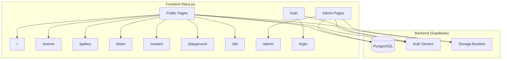

# LIFE ROBO — Robotics Club, University of Lucknow

**Learn and Innovation in the Field of Engineering**

A modern web platform for the Robotics Club of University of Lucknow, featuring 3D graphics, interactive tools, and a dynamic content management system.

---

## Table of Contents

- [Overview](#overview)
- [Current vs New](#current-vs-new)
- [Tech Stack](#tech-stack)
- [Architecture](#architecture)
- [Features](#features)
- [Project Structure](#project-structure)
- [Database Schema](#database-schema)
- [Authentication & Roles](#authentication--roles)
- [Getting Started](#getting-started)
- [Development](#development)
- [Deployment](#deployment)
- [Timeline](#timeline)
- [Documentation](#documentation)

---

## Overview

This project migrates the existing static HTML website of LIFE ROBO to a modern, dynamic web application. The new platform introduces:

- **3D Interactive Elements**: Animated robot models on the landing page
- **Real-time Content Management**: Admin dashboard for updating events and team members
- **Interactive Tools**: Browser-based code editor and 3D robot playground
- **Secure Authentication**: Role-based access for members and administrators

---

## Current vs New

| Aspect | Current State | New Platform |
|--------|---------------|--------------|
| Technology | Static HTML/CSS | Next.js 14 + Supabase |
| Pages | 5 HTML files | 9+ dynamic routes |
| Content Updates | Manual code editing | Admin CMS dashboard |
| Authentication | None | Supabase Auth |
| Database | None | PostgreSQL (Supabase) |
| 3D Graphics | None | React Three Fiber |
| Interactive Tools | None | IDE, Playground |

---

## Tech Stack

| Layer | Technology | Purpose |
|-------|------------|---------|
| **Framework** | Next.js 14 | React framework with App Router |
| **Language** | TypeScript | Type-safe development |
| **Styling** | Tailwind CSS | Utility-first CSS with dark theme |
| **3D Graphics** | React Three Fiber | Three.js wrapper for React |
| **3D Helpers** | @react-three/drei | Useful R3F components |
| **Animations** | Framer Motion | Scroll and page transitions |
| **Backend** | Supabase | Auth, Database, Storage |
| **Code Editor** | Monaco Editor | VS Code editor component |
| **Python Runtime** | Pyodide | Python execution in browser |

---

## Architecture



---

## Features

### Public Features (All Users)

| Feature | Route | Description |
|---------|-------|-------------|
| **Landing Page** | `/` | 3D animated robot hero, mission statement, domain expertise cards |
| **Team** | `/team` | Patrons, faculty, and coordinator profiles with social links |
| **Events** | `/events` | Dynamic event grid with categories, lightbox for details |
| **Gallery** | `/gallery` | Masonry photo layout from workshops and lectures |
| **Contact** | `/contact` | Contact form with email integration |
| **Playground** | `/playground` | Interactive 3D scene to control virtual robot |
| **IDE** | `/ide` | Browser-based code editor with Python/C++ syntax highlighting |

### Member Features (Logged-in Users)

| Feature | Description |
|---------|-------------|
| **Project Saving** | Save code snippets to personal cloud storage |
| **Profile** | Manage personal information |

### Admin Features

| Feature | Route | Description |
|---------|-------|-------------|
| **Dashboard** | `/admin` | Overview of site content |
| **Events CMS** | `/admin/events` | Create, edit, delete events |
| **Team CMS** | `/admin/team` | Manage team member profiles |
| **Gallery CMS** | `/admin/gallery` | Upload and organize photos |

---

## Project Structure

```
src/
├── app/
│   ├── layout.tsx              # Root layout, fonts, providers
│   ├── page.tsx                # Landing page (/)
│   ├── events/
│   │   └── page.tsx            # Events listing
│   ├── gallery/
│   │   └── page.tsx            # Photo gallery
│   ├── team/
│   │   └── page.tsx            # Team members
│   ├── contact/
│   │   └── page.tsx            # Contact form
│   ├── playground/
│   │   └── page.tsx            # 3D robot demo
│   ├── ide/
│   │   └── page.tsx            # Code editor
│   ├── login/
│   │   └── page.tsx            # Authentication
│   └── admin/
│       ├── page.tsx            # Admin dashboard
│       ├── events/page.tsx     # Events CMS
│       └── team/page.tsx       # Team CMS
├── components/
│   ├── layout/
│   │   ├── Navbar.tsx          # Navigation bar
│   │   └── Footer.tsx          # Site footer
│   ├── 3d/
│   │   ├── HeroRobot.tsx       # R3F Canvas with robot
│   │   └── RobotModel.tsx      # GLTF model loader
│   ├── sections/
│   │   ├── HeroSection.tsx     # Landing hero
│   │   ├── MissionSection.tsx  # Mission card
│   │   └── ExpertiseSection.tsx # Domain cards
│   └── ui/
│       ├── Button.tsx          # Styled button
│       ├── Card.tsx            # Content card
│       ├── Modal.tsx           # Dialog modal
│       └── Lightbox.tsx        # Image viewer
├── lib/
│   ├── supabase/
│   │   ├── client.ts           # Browser Supabase client
│   │   └── server.ts           # Server Supabase client
│   └── utils.ts                # Helper functions
└── middleware.ts               # Route protection
```

---

## Database Schema

### `events` Table

| Column | Type | Description |
|--------|------|-------------|
| `id` | uuid | Primary key |
| `title` | text | Event name |
| `description` | text | Full description |
| `date` | date | Event date |
| `type` | enum | `workshop`, `competition`, `lecture` |
| `image_url` | text | Poster/banner image |
| `external_link` | text | YouTube or external URL |
| `created_at` | timestamp | Creation time |

### `team_members` Table

| Column | Type | Description |
|--------|------|-------------|
| `id` | uuid | Primary key |
| `name` | text | Full name |
| `role` | text | Position title |
| `category` | enum | `patron`, `faculty`, `coordinator` |
| `image_url` | text | Profile picture |
| `linkedin` | text | LinkedIn URL |
| `instagram` | text | Instagram URL |
| `order` | int | Display order |

### `projects` Table (IDE)

| Column | Type | Description |
|--------|------|-------------|
| `id` | uuid | Primary key |
| `user_id` | uuid | Owner (FK to auth.users) |
| `title` | text | Project name |
| `code` | text | Source code |
| `language` | enum | `python`, `cpp` |
| `created_at` | timestamp | Creation time |

---

## Authentication & Roles

| Role | Access Level |
|------|--------------|
| **Public** | All public pages, Playground, IDE (no saving) |
| **Member** | Above + Save projects, personal profile |
| **Admin** | Above + Full CMS access |

### Route Protection

```typescript
// middleware.ts
const adminRoutes = ['/admin']
// Redirect unauthorized users to /login
```

---

## Getting Started

### Prerequisites

- Node.js 18+
- npm or pnpm
- Supabase account

### Installation

```bash
# Clone the repository
git clone https://github.com/your-org/life-robo.git
cd life-robo

# Install dependencies
npm install

# Copy environment template
cp .env.example .env.local
```

### Environment Variables

```env
NEXT_PUBLIC_SUPABASE_URL=your-supabase-url
NEXT_PUBLIC_SUPABASE_ANON_KEY=your-anon-key
```

### Run Development Server

```bash
npm run dev
```

Visit [http://localhost:3000](http://localhost:3000)

---

## Development

```bash
# Lint code
npm run lint

# Format code
npm run format

# Build for production
npm run build

# Start production server
npm start
```

---

## Deployment

### Recommended: Vercel

1. Push code to GitHub
2. Connect repository to Vercel
3. Add environment variables in Vercel dashboard
4. Deploy

### Alternative: Self-hosted

```bash
npm run build
npm start
```

---

## Timeline

| Phase | Scope | Duration |
|-------|-------|----------|
| **Setup** | Next.js init, Supabase config, Layout | 1 week |
| **Phase 1** | Landing, Team, Events, Gallery, Contact, Auth | 2 weeks |
| **Phase 2** | Playground, IDE, Admin Dashboard | 2 weeks |
| **Testing** | QA, Performance, Mobile | 1 week |
| **Total** | | **~6 weeks** |

---

## Documentation

| Document | Description |
|----------|-------------|
| [MIGRATION_PLAN.md](./MIGRATION_PLAN.md) | Detailed technical implementation plan |

---

## Design Tokens (Google Antigravity Theme)

| Token | Value | Description |
|-------|-------|-------------|
| `--bg-primary` | `#0d0d0d` | True dark |
| `--bg-secondary` | `#1a1a1a` | Elevated surface |
| `--bg-card` | `rgba(26, 26, 26, 0.8)` | Glassmorphic card |
| `--accent-primary` | `#4285f4` | Google Blue |
| `--accent-secondary` | `#34a853` | Google Green |
| `--accent-tertiary` | `#ea4335` | Google Red |
| `--accent-quaternary` | `#fbbc04` | Google Yellow |
| `--accent-gradient` | `linear-gradient(135deg, #4285f4, #34a853)` | Blue to Green |
| `--text-primary` | `#e8eaed` | Light gray |
| `--text-secondary` | `#9aa0a6` | Muted gray |
| `--glow` | `0 0 24px rgba(66, 133, 244, 0.4)` | Blue glow |
| `--glass-blur` | `backdrop-filter: blur(16px)` | Frosted glass |
| `--font-display` | Google Sans Flex | Google's display font |
| `--font-body` | Google Sans | Google's body font |
| `--font-code` | Google Sans Code | Monospace for IDE |

---

## License

All rights reserved © Robotics Club, University of Lucknow

---

**Built with ❤️ by the LIFE ROBO Web Team**
